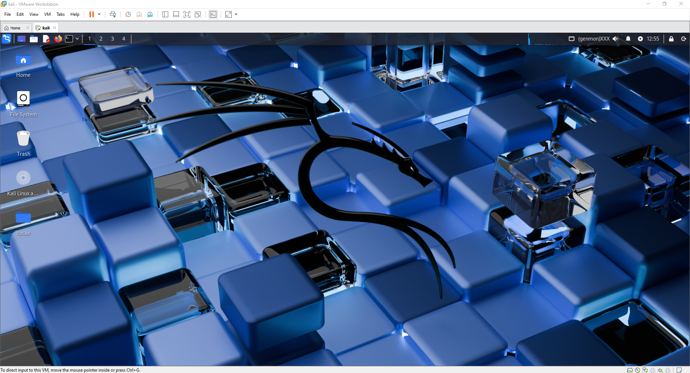
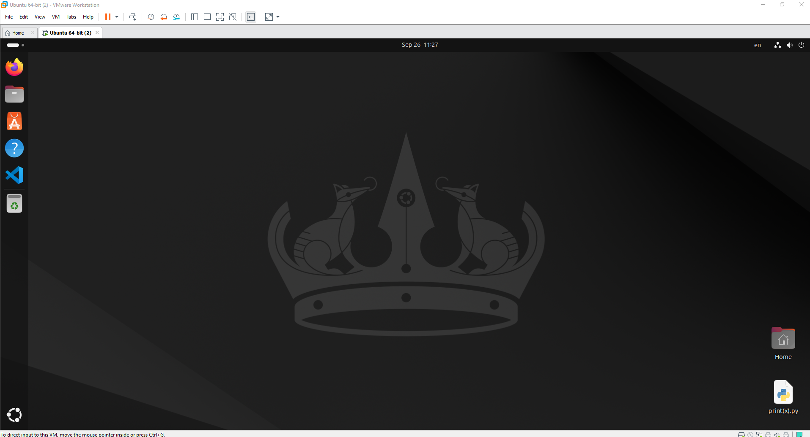

**✍️ Main Topics today:**
- Finalizing the main project `README.md`
- Structuring the chapter guides for `00-Introduction` and `01-Setup`
- Deep dive into Markdown formatting for professional documentation
- Learning the importance of separating "project-level" vs. "chapter-level" information

---

**✍️ My Understanding & Notes:**
Today was another foundational day. I realized that a professional repository isn't just about the code, but also about how it's presented. I spent the entire day structuring the main entry points of my project and making sure the documentation is clear and easy to follow.

---

**🤯 Challenges & Questions:**
The biggest challenge today was wrestling with Markdown formatting. I struggled for a while with copy-paste issues that were breaking the layout of my files, especially the headings and code blocks.

---

**💡 Discoveries & Resources Today:**
- I discovered the importance of **atomic commits**: making one small change at a time and committing with a clear message.
- Feedback and guidance from others helped me quickly resolve structural issues in the repository.
- The collaborative process is teaching me a lot about both code and documentation.

---

**💻 A Key Code Snippet I Wrote:**
No Python today. The most important "code" was perfecting the Markdown structure. Here’s the clean structure for a chapter guide that I finalized:

---
 
# ⚙️ Chapter Title

Introductory paragraph explaining the chapter's purpose.
 
## Step 1: First Concept

- Details and explanations.
- Code examples in a block.
 
---

### 🗓️ Date: 2025-09-26

**✅ Today's Mission:**
- Build my digital laboratory: a virtualization setup with VMware
- Install the arsenal: Kali Linux for cybersecurity and Ubuntu for AI development

---

**✍️ The Battle Log:**
Today wasn't about writing code. It was about forging the tools. The plan was simple: set up two virtual machines to keep my cybersecurity and Python worlds separate. But the process was more challenging than expected.

---

**🤯 Challenges & Almost-Defeats:**
The main problem was the Ubuntu installation. It kept failing and hung up multiple times, just when I thought I was making progress. I almost gave up after several frustrating attempts.

And then, unexpectedly, the power went out and I lost hours of work. I was completely drained and had to take a break before starting again.

---

**🏆 The Spoils of War:**

---

**💡 Discoveries & Allies:**
- **The limits of standard guides:** YouTube tutorials were helpful, but the real breakthroughs came from deep-diving into Google searches and using AI tools.
- **Ultimate debugging tool: a nap.** Taking a break gave me a fresh perspective and helped me solve the issues faster.
- **The strange joy of a hard-won battle:** Despite being exhausted, I felt a sense of achievement after overcoming these problems.

---

**💻 Today's Mantra:**
No Python today. The only line that mattered was the one I kept telling myself:

> "Just one more try."

---

### 🗓️ Date: 2025-09-27

**✅ Today's Mission:**
- New hardware setup: migrating my development environment to a brand new laptop

---

**✍️ The Battle Log:**
No Python code was written today, but it was one of the most productive days yet. The whole day was dedicated to setting up my new laptop, which is a critical investment in my future work. It was a long process, but worth the effort.

---

**🤯 Challenges & Questions:**
The main challenge was the amount of time required to get everything perfect. Migrating settings and ensuring all my tools work correctly on a new machine is a detailed and slow process. It reminded me that preparation and foundation work are as important as coding itself.

---

**💡 Discoveries & Resources Today:**
- I gained a deeper appreciation for a clean setup. Starting fresh on a new machine is a great opportunity to organize files and tools better than before. It’s an important step toward long-term productivity.

---

**💻 Today's "Code":**
The most repeated command of the day wasn't in Python—it was in my head:

> "Is everything installed yet?"

---